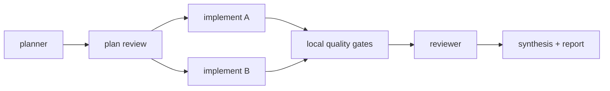

# Graph Skill

**Graph engineering for Claude Code, Codex, OpenCode, and Cursor.**
Stop having one long agent conversation. Plan the work as a dependency graph of small, focused nodes — cached, validated, and retried individually — and watch it run live in your terminal.

[](https://github.com/gwaghmar/graph/actions/workflows/ci.yml)
[](LICENSE)
[](package.json)

```
npx graph-skill install
```

---

### This is what a run looks like — live, in your terminal, zero extra tokens:

```text
◉ de140d98b1 · running  [████████░░░░░░] 3/5
✔ inspect · analysis · 2.1s
├─ ✔ analysis · analysis · 4.0s ← inspect
├─ ✔ quality · validation · 1.2s ← inspect
└─ ▶ review · review ← inspect
   └─ ○ synthesis · synthesis ← analysis,quality,review
```

No polling, no dashboard, no plugin. That tree is printed straight to stdout by a local Python script every time a node changes state — no model call involved.

---

## Table of contents

- [Why](#why)
- [How a run looks](#how-a-run-looks)
- [Install](#install)
- [Usage](#usage)
- [Features](#features)
- [Supported hosts](#supported-hosts)
- [Runtime reference](#runtime-reference)
- [FAQ](#faq)
- [Contributing](#contributing)

## Why

Long single-conversation agent runs share one failure mode: something goes wrong halfway through, and you either accept a broken result or re-run the whole thing from scratch, burning tokens on the parts that already worked.

Graph engineering fixes this by treating a coding task as a **dependency graph**, not a monologue:

| | Single long conversation | Graph Skill |
|---|---|---|
| Unit of work | One continuous context | Small, bounded nodes with explicit dependencies |
| Parallelism | None — sequential by construction | Independent nodes run concurrently |
| A step fails | Re-run everything, or patch by hand | Only that node + its dependents re-run |
| Unchanged work | Re-sent to the model every time | Served from a local content cache |
| Progress visibility | Scrollback | Live ASCII graph, updated per node |
| Checks before review | Ad hoc | Lint/types/tests run locally before any reviewer spends tokens |

Graph Skill brings this directly into the coding assistant you already use — one install command, no orchestration framework, no separate service to run.

## How a run looks



- Independent nodes (`implement A`, `implement B`) run in parallel.
- A failed node reruns alone, along with only its dependents — never the whole graph.
- Unchanged nodes are served from the local content cache instead of new model calls.
- Deterministic checks (lint, types, tests) run before any AI reviewer spends tokens.

## Install

Requirements: **Node.js 18+** (for the installer) and **`python3` on PATH** (for the local runtime; on Windows, install Python and confirm `python3` resolves).

```bash
npx graph-skill install
```

> Package not on npm yet? Install straight from GitHub — works identically:
> ```bash
> npx github:gwaghmar/graph install
> ```

The installer auto-detects your active host and installs only that adapter. Force a specific one with `--target`:

```bash
npx graph-skill install --target codex
npx graph-skill install --target claude
npx graph-skill install --target opencode
npx graph-skill install --target cursor
```

## Usage

```text
/graph Build OAuth login and tests
```

| Host | Invocation |
|---|---|
| Claude Code | `/graph Build OAuth login and tests` |
| Codex | `$graph Build OAuth login and tests` |
| OpenCode | `/graph Build OAuth login and tests` |
| Cursor | `@graph Build OAuth login and tests` |

Optional flags:

```text
/graph --resume
/graph Build OAuth login --commit
```

`--resume` continues the latest incomplete run. `--commit` grants explicit permission to commit — without it, nothing gets committed for you.

## Features

**Live and local, every run:**
- **Live text graph** — every node state transition prints a compact rendering of the run graph: progress bar, status glyphs (`✔ ▶ ↻ ✖ ⚡ ○`), tree connectors, per-node roles and durations, retries, cache hits, and recorded tokens. Rendered locally in Python — zero model tokens. Reprint any time: `.graph/graph.py tree <run>`.
- **Final run summary** — a complete recap: task, final node graph, quality checks, files touched, retries, cache hits, duration, recorded tokens, and the report path. `.graph/graph.py summary <run>`.
- **Interactive HTML report** — `.graph/runs/<run-id>/graph.html` rewrites on every state change; reload it in a browser for nodes, dependencies, duration, files, retries, cache hits, and checks.
- **Smart retry** — reruns only failed nodes and their dependents.
- **Local quality gates** — auto-detects npm lint/typecheck/test, pytest, Cargo, or Go tests, and runs them before spending tokens on a reviewer.
- **Content cache** — reuses successful nodes when the task and relevant file contents are unchanged.
- **Resume** — continues the latest incomplete run.
- **Optional commit** — commits only with explicit `--commit` permission.
- **Local statistics** — completed nodes, failures, retries, cache hits, changed files, execution duration.

All reporting, checks, retry planning, cache lookup, and graph rendering run **locally** and use **no model tokens**. Token counts are shown only when the host actually exposes real usage data — most don't, so you'll see `0` rather than a made-up number.

## Supported hosts

| Host | Adapter | Trigger |
|---|---|---|
| [Claude Code](https://claude.com/claude-code) | `.claude/commands/graph.md` | `/graph` |
| [Codex](https://openai.com/codex/) | `.codex/skills/graph/` | `$graph` |
| [OpenCode](https://opencode.ai/) | `.opencode/commands/graph.md` | `/graph` |
| [Cursor](https://cursor.com/) | `.cursor/rules/graph.mdc` | `@graph` |

Each adapter is a thin prompt/rule file pointing at the same shared `.graph/` runtime — installing for a second host on the same repo reuses it.

## Runtime reference

```bash
python3 .graph/graph.py init "demo" --host codex
python3 .graph/graph.py node RUN planner --role planner --status running
python3 .graph/graph.py quality RUN
python3 .graph/graph.py retry-plan RUN --include-dependents
python3 .graph/graph.py resume
python3 .graph/graph.py tree RUN      # live ASCII graph
python3 .graph/graph.py summary RUN   # final run summary
```

## FAQ

**Does this call an LLM to render the graph or reports?**
No. `tree`, `summary`, the HTML report, quality gates, caching, and retry planning are all plain Python/local logic — they cost zero tokens.

**What happens if a node fails?**
Only that node and whatever depends on it re-runs. Everything upstream and every independent branch is left alone.

**Will it commit my code without asking?**
No — commits only happen with an explicit `--commit` flag on the invocation.

**Does it work without an internet connection to the runtime?**
The runtime itself (`graph.py`) is a local, dependency-free Python script — it just needs `python3` on PATH. Your host's model calls still need a connection.

## Contributing

Issues and PRs welcome — see [open issues](https://github.com/gwaghmar/graph/issues). Run the test suite before opening a PR:

```bash
npm test
```

## License

[MIT](LICENSE)
