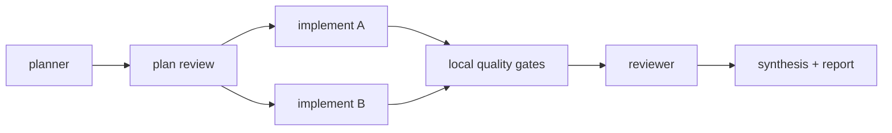

# Graph Skill

Installable **graph engineering** for Claude Code, Codex, OpenCode, and Cursor.

Graph engineering is the successor to prompt, context, and loop engineering: instead of one long agent conversation, work is designed as a dependency graph of small, focused agents — planned, cached, validated, and retried node by node. Graph Skill brings that directly into your coding assistant with one install command — no framework, no orchestration code.

## How a run looks



- Independent nodes (`implement A`, `implement B`) run in parallel.
- A failed node reruns alone, along with only its dependents — never the whole graph.
- Unchanged nodes are served from the local content cache instead of new model calls.
- Deterministic checks (lint, types, tests) run before any AI reviewer spends tokens.

## Requirements

- Node.js 18+ (for the installer)
- `python3` on PATH (for the local runtime; on Windows install Python and ensure `python3` resolves)

## Install

```bash
npx graph-skill install
```

The installer detects one active host and installs only that adapter. Override with `--target codex`, `--target claude`, `--target opencode`, or `--target cursor`.

## Invoke

- Claude Code: `/graph Build OAuth login and tests`
- Codex: `$graph Build OAuth login and tests`
- OpenCode: `/graph Build OAuth login and tests`
- Cursor: `@graph Build OAuth login and tests`

Optional:

```text
/graph --resume
/graph Build OAuth login --commit
```

## v0.3 features

- **Interactive live report:** `.graph/runs/<run-id>/graph.html` refreshes whenever state changes and shows nodes, dependencies, duration, files, retries, cache hits, and checks. Token counts appear only when the host exposes real usage; most hosts do not, so expect 0 rather than invented numbers.
- **Smart retry:** retries only failed nodes and affected dependents.
- **Local quality gates:** auto-detects npm lint/typecheck/test, pytest, Cargo, or Go tests before spending tokens on reviewers.
- **Content cache:** reuses successful nodes when the task and relevant file contents are unchanged.
- **Resume:** continues the latest incomplete run.
- **Optional commit:** commits only with explicit `--commit` permission.
- **Local statistics:** completed nodes, failures, retries, cache hits, changed files, and execution duration.

All reporting, checks, retry planning, cache lookup, and graph rendering run locally and use no model tokens.

## Runtime examples

```bash
python3 .graph/graph.py init "demo" --host codex
python3 .graph/graph.py node RUN planner --role planner --status running
python3 .graph/graph.py quality RUN
python3 .graph/graph.py retry-plan RUN --include-dependents
python3 .graph/graph.py resume
```
